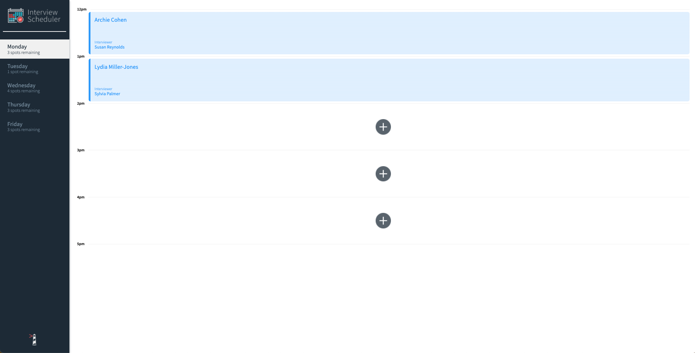
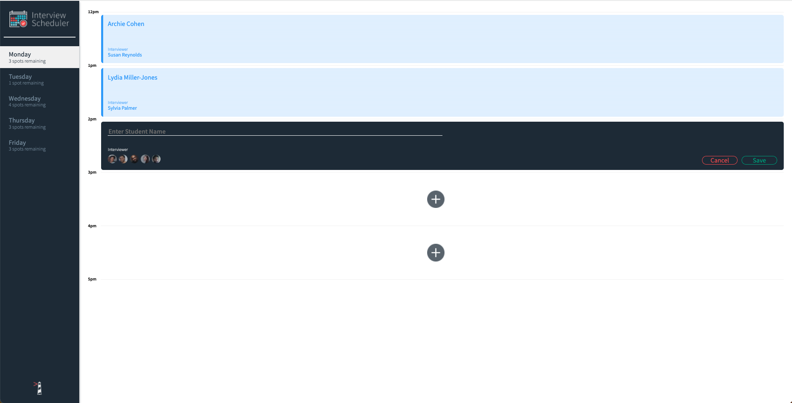
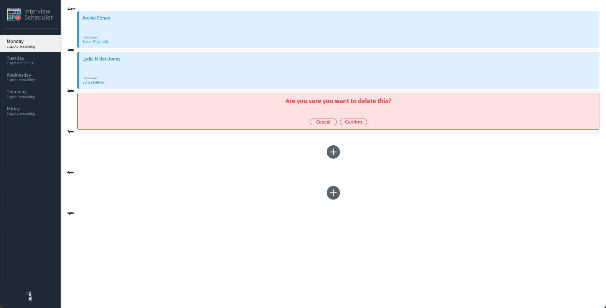
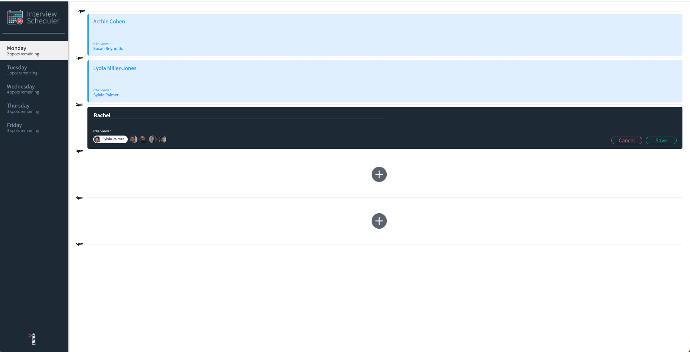

# Interview Scheduler
Interview Scheduler is an app that lets users book technical interviews between students and mentors. Appointments can be between the hours of 12 PM and 5 PM, Monday to Friday. It was created while learning at Lighthouse Labs.

Each appointment has one student and one interviewer. When creating a new appointment, the user can enter any student name while the interviewer is chosen from a predefined list.

The front end of this project is built with React and makes requests to an API to fetch and store appointment data from a database.

## Screenshots

### Screenshot of front page of the app


### Screenshot of the form when booking an appointment


### Screenshot of the prompt when deleting an appointment


### Screenshot of the form when editing an existing appointment


## Dependencies
- react
- react-dom
- react-scripts
- axios
- classnames
- normalize.css

## Dev Dependencies
- react-testing-library
- cypress
- storybook

## Setup

Install dependencies with `npm install`.

## Running Webpack Development Server
The following commands will open up the app on <http://localhost:8000/> in your browser
```sh
npm start
```

## Running Jest Test Framework

```sh
npm test
```

## Running Storybook Visual Testbed

```sh
npm run storybook
```

## Functionality
1. Users can add in appointments by clicking the "+" button in an open time slot, typing their name, and selecting the interviewer
2. Once an appointment is booked it will turn a blue colour to show the appointment is booked for that time slot
3. Appointments can be edited by clicking the "notepad" icon in the bottom right-hand corner of the appointment slot
4. Appointments can be deleted by clicking the "trashcam" n the bottom right-hand corner of the appointment slot
6. A loading element will appear when the appointment is being saved or deleted
7. Users cannot book appointments past 5 pm
8. The number of spots reamining per day will be shown below the name of the day in the left panel
9. A user must type in a name and select and interviewer to book an appointment